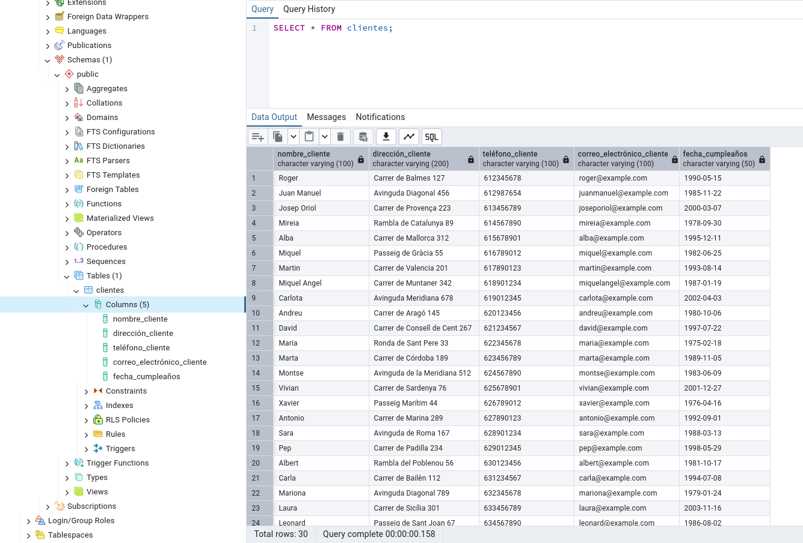
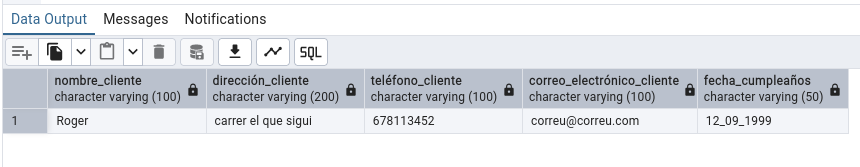
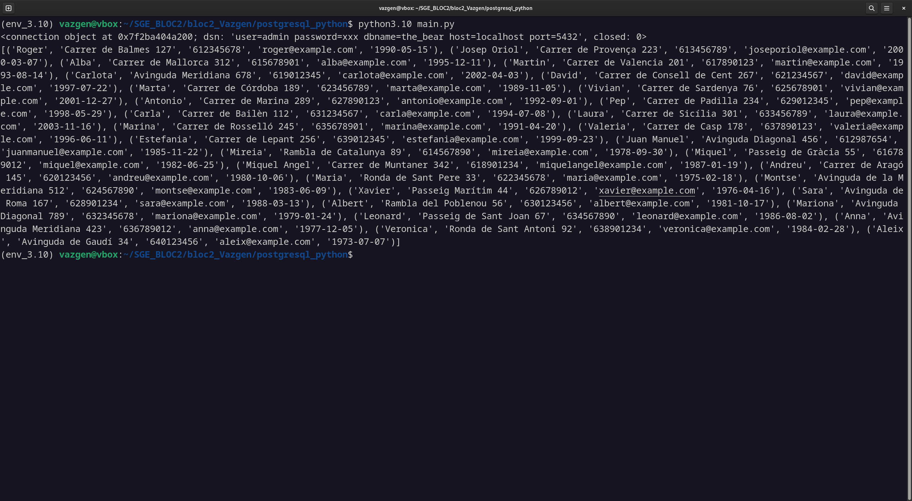
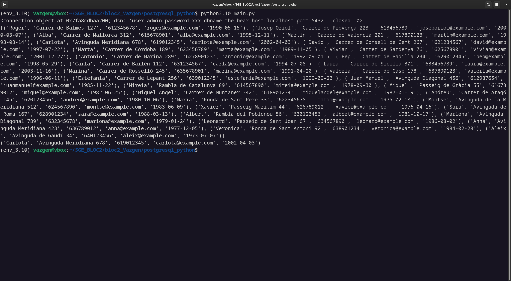

El que veiem a aquesta imatge es una consulta de SQL que mostra totes les dades que hem inserit mitjançant els scripts **csv_to_dict.py** i **dict_to_db.py**, l'arxiu **csv_to_dict.py** converteix el csv **Clientes.csv** a un diccionari on les keys son les capçaleres de cada columna i cada valor es una llista de les dades d'aquella columna i l'arxiu **dict_to_db.py** crea i executa la inserció de les dades a la bases de dades 

En aquesta captura podem veure l'execució d'un script de python que imprimeix per la terminal totes les dades que hi han a la base de dades, ens las mostra en una llista de tuples **(es com una llista pero no es pot modificar)** on cada tupla es una fila de la base de dades

En aquesta captura es pot veure la mateixa llista d'abans mes el cinque element de la llista que en aquest cas es l'usuari 'Carlota'.