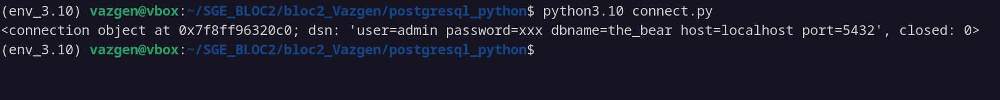
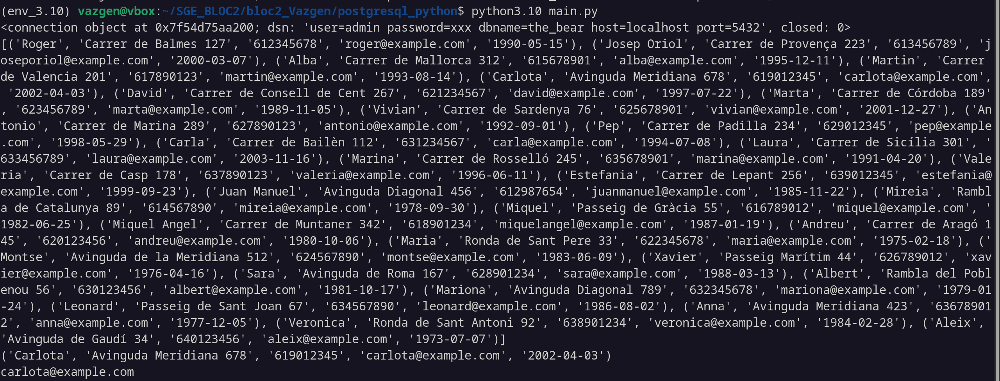
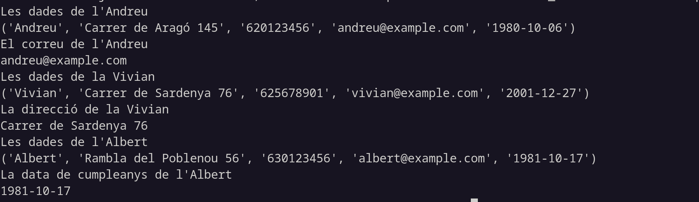
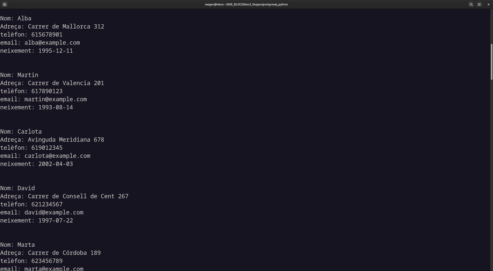
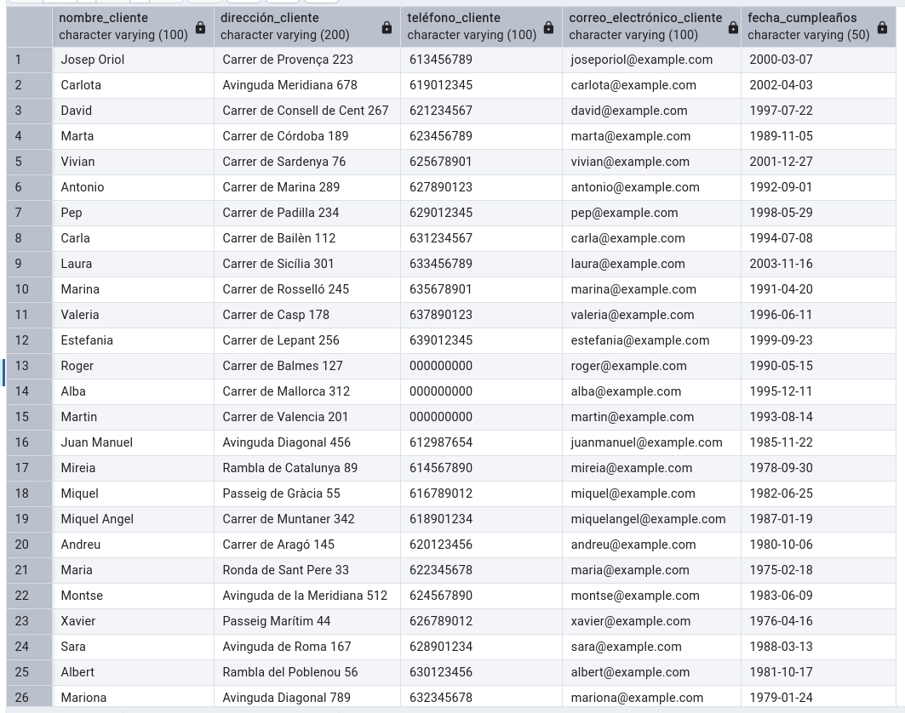

# SGE_BLOC2

El que veiem a la imatge és la declaració d'un objecte que consisteix en la connexió amb una base de dades i es pot veure algunes especificacions de la base de dades com el nom de l'usuari que ha creat la base de dades, la contrasenya (censurada òbviament), el nom de la base en aquest cas "the_bear" i també on està allotjada la base de dades en aquest cas al localhost i al port 5432

La part on posa closed: 0 suposo que vol dir que la connexió amb la base de dades esta oberta

El que veiem a aquesta imatge es una consulta de SQL que mostra totes les dades que hem inserit mitjançant els scripts **csv_to_dict.py** i **dict_to_db.py**, l'arxiu **csv_to_dict.py** converteix el csv **Clientes.csv** a un diccionari on les keys son les capçaleres de cada columna i cada valor es una llista de les dades d'aquella columna i l'arxiu **dict_to_db.py** crea i executa la inserció de les dades a la bases de dades 

En aquesta captura podem veure l'execució d'un script de python que imprimeix per la terminal totes les dades que hi han a la base de dades, ens las mostra en una llista de tuples **(es com una llista pero no es pot modificar)** on cada tupla es una fila de la base de dades

En aquesta captura es pot veure la mateixa llista d'abans mes el cinque element de la llista que en aquest cas es l'usuari 'Carlota'.

En aquesta captura veiem la llista de tots el clients, la tupla de Carlota i el quart element de la tupla.

En aquesta captura es mostren algunes dades de la llista de clients.

El que es veu a aquesta captura son les dades de cada client de la base de dades en un format mes llegible.

Com podem veure a aquesta captura s'han modificat els telefons de Roger, Alba i Martin gracies al script update que hem creat abans.

